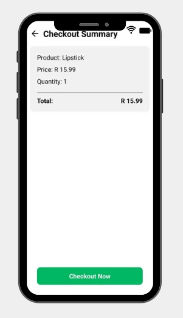

# Payment Gateway Integration Project

This is a **Payment Gateway Integration Application** built using **React Native** with Stripe as the payment provider. The app allows users to browse products, view descriptions and prices, proceed to a summary page, and complete a secure payment using Stripe.

## Features

### Product Selection:
1. **List of Products:**
   - Display a list of available products with images, names, and prices.
   - Allow users to select a product to view more details.
   
2. **Product Details:**
   - Show product description, price, and relevant details.
   - Option to proceed to checkout.

### Payment Integration:
1. **Select Payment Gateway:**
   - Stripe is used as the payment gateway provider.
   - Ensures security and PCI compliance.
   
2. **Set Up Payment Gateway:**
   - Create an account with Stripe and complete verification.
   - Retrieve API keys (publishable & secret keys) from the Stripe dashboard.
   
3. **Integrate Payment SDK:**
   - Install and configure Stripe SDK in the project.
   - Initialize Stripe with API keys during app initialization.
   
4. **Checkout Process:**
   - Display a summary page before checkout.
   - Collect user payment details: Card Number, Expiry Date, and CVC.
   
5. **Handle Payment Events:**
   - Manage successful, failed, or canceled payment transactions.
   - Display appropriate messages for user feedback.
   
6. **Test Payment Processing:**
   - Use Stripe's sandbox environment for testing transactions.
   - Verify successful transactions and correct error handling.
   
7. **Handle Payment Responses:**
   - Update UI based on transaction success or failure.
   - Show confirmation screen upon successful payment.

### Security and Compliance:
1. **Secure Transactions:**
   - Ensure compliance with PCI DSS standards.
   - Use secure encryption for storing sensitive payment data.
   
2. **Error Handling:**
   - Display meaningful error messages for failed transactions.
   - Handle incorrect card details or expired cards gracefully.

### API Integration:
1. **CRUD Operations for Products:**
   - Retrieve product list from API.
   - Update or delete products as needed.

2. **Authentication:**
   - Use API keys for secure API access.

### Testing & Performance:
1. **Functional Testing:**
   - Ensure smooth navigation between product selection and payment.
   - Test Stripe integration for multiple payment scenarios.
   
2. **Performance Optimization:**
   - Optimize API calls for faster product retrieval.
   - Reduce latency in payment processing.

## Technology Stack
- **Frontend:** React Native
- **Styling:** CSS
- **Payment Gateway:** Stripe
- **API Integration:** REST API


## Installation

To run this project locally, follow these steps:

1. Clone the repository:
   ```bash
   git clone https://github.com/Portia-Nelly-Mashaba/payment-gateway.git
   ```
2. Navigate to the project directory:
   ```bash
   cd payment-gateway-app
   ```
3. Install dependencies:
   ```bash
   npm install
   ```
4. Start the application:
   ```bash
   npx react-native run-android  # For Android
   npx react-native run-ios      # For iOS
   ```

## API & Payment Endpoints
| Method | Endpoint       | Description                 |
|--------|--------------|-----------------------------|
| POST   | /checkout    | Process a payment request  |

## Screenshots





## License
This project is licensed under the MIT License.


